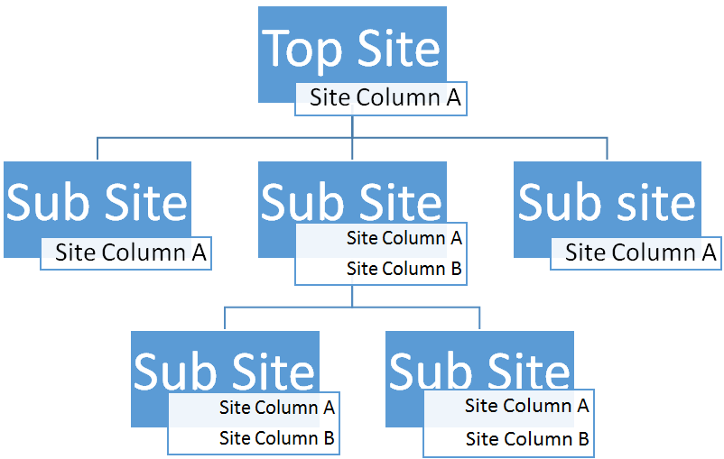

# 网站栏 Site Column
    作者：柒月

##什么是网站栏
`网站栏`是构成SharePoint数据最基本的元素之一，可以将它看做一类可重用的列定义，我们可以在内容类型和列表中添加网站栏（网站内容类型/列表设置->从现有网站栏添加）。

###举个栗子
我们首先创建一个`网站栏`叫做`备注`，指定MaxLength为100。随后，我们创建很多SPList，并添加`备注`栏，那么，添加的这些`网站栏`都具有同一个属性——MaxLength为100。随着时间推移，也许MaxLength=100不能满足现有的业务需求，那我们只需修改此`网站栏`的属性。将MaxLength重新设置为120，保存后，所有引用这个网站栏的列表或内容类型MaxLength都将变为120。

###作用范围
在网站上创建一个网站栏时，该网站栏也将对其所有子网站可用，也就是说，子网站的列表和内容类型也可以引用这个网站栏。


###网站栏的属性
- **名称**，网站栏的`Name`属性在其*作用范围*之内必须是唯一的
- **数据类型**，如：单行文本，多行文本，查阅项，数字，日期 等
- **组**，将网站栏进行分类管理
- **其他设置**，如：栏验证，默认值 等


##如何创建网站栏

- **SharePoint用户界面** 网站设置->网站栏->创建

- **对象模型** 例：

``` C#
RunWithElevatedPrivileges(delegate()
            {
                using (SPSite site = new SPSite(SPContext.Current.Site.Url))
                {
                    SPWeb web = site.RootWeb;
                    //Create Site Column
                    string SiteColumnName = "India";
                    //Add choice Field "India"
                    if (!web.Fields.ContainsField(SiteColumnName))  
                    {
                        string countryField = web.Fields.Add(SiteColumnName, SPFieldType.Choice, false);
                        //Set the Field Properties
                        SPFieldChoice CityInIndia = (SPFieldChoice)web.Fields.GetField(SiteColumnName);
                        //Set the group for the Site column
                        CityInIndia.Group = "States";   
                        //Add the choices
                        string[] States = new string[] { "TamilNadu", "Kerala", "Andhra Pradesh", "karnataka"};
                        CityInIndia.Choices.AddRange(States);
                        //Set the default value
                        CityInIndia.DefaultValue = "TamilNadu";
                        //Set Fillable value
                        CityInIndia.FillInChoice = true;
                        //Update the field
                        CityInIndia.Update();
  
                    }
                }
            });
- See more at: http://www.sharepointpals.com/post/Create-a-Site-Column-in-SharePoint-2010#sthash.rMRlH8jo.dpuf
```

- **PowerShell** 例：
```
 $site = Get-SPSite -Identity "http://sfs03-pc:12121/sites/Samples/"
 $web = $site.RootWeb
 $fieldXML = '<Field Type="Text"
 Name="EmpName"
 Description="Employee Name Column Info."
 DisplayName="EmpName"
 Group="EmployeeInformation"
 Hidden="FALSE"
 Required="FALSE"
 ShowInDisplayForm="TRUE"
 ShowInEditForm="TRUE"
 ShowInListSettings="TRUE"
 ShowInNewForm="TRUE"></Field>'
 $web.Fields.AddFieldAsXml($fieldXML)
 $web.Dispose()
 $site.Dispose()
- See more at: http://www.sharepointpals.com/post/Create-a-Site-Column-in-SharePoint-2010#sthash.rMRlH8jo.dpuf
```
- **Visual Studio中定义（XML）** SharePoint项目（VS2013）->添加->新建项->网站栏 编辑Elements.xml 例：
``` XML
<?xml version="1.0" encoding="utf-8"?>
<Elements xmlns="http://schemas.microsoft.com/sharepoint/">
  <!--SYS_LookupTypes_ContentType Columns Start-->
  <Field ID="{A0D69522-274A-458C-BB21-5DD4DEC5B037}" Name="APP_CODE" DisplayName="APP_CODE" Type="Text" Required="FALSE" Group="SYS_Columns">
  </Field>
  <Field ID="{D1C38307-8BD3-4E75-92B5-AB42B65780D6}" Name="SYSCODE_FLAG" DisplayName="SYSCODE_FLAG" Type="Boolean" Required="FALSE" Group="SYS_Columns">
  </Field>
  <Field ID="{A3A63C98-AFE0-4B84-A62A-C83FCDD4AA48}" Name="LOOKUP_CODE" DisplayName="LOOKUP_CODE" Type="Text" Required="FALSE" Group="SYS_Columns">
  </Field>
  <Field ID="{6C887616-7FF0-43C2-903A-837069EFC393}" Name="LOOKUP_NAME" DisplayName="LOOKUP_NAME" Type="Text" Required="FALSE" Group="SYS_Columns">
  </Field>
  <Field ID="{CD63EA9E-B1BB-4061-8804-452D4B33557A}" Name="REMARK" DisplayName="REMARK" Type="Note" Required="FALSE" Group="SYS_Columns">
  </Field>
  <Field ID="{25C32A16-8B01-42F0-8A91-DF0A8A0AB4B5}" Name="ENABLE" DisplayName="ENABLE" Type="Boolean" Required="FALSE" Group="SYS_Columns">
  </Field>
  <!--SYS_LookupTypes_ContentType Columns Start-->
</Elements>
```

参考：[Field Element (Field)](https://msdn.microsoft.com/en-us/library/office/aa979575.aspx)
