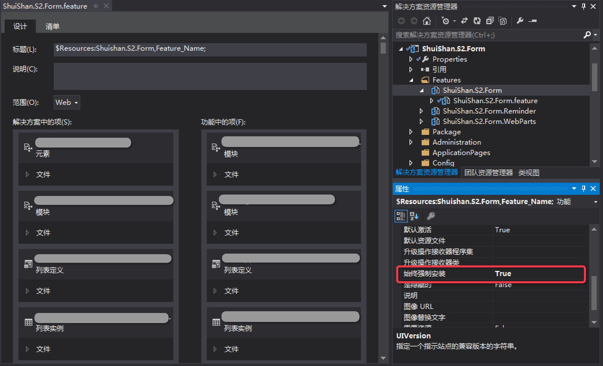

# 在VS中强制部署Feature

    作者：杨柳@水杉网络
    

## 长长的引子

在号称全宇宙无敌人见人爱花见花开的最强IDE -- Visual Studio中，SharePoint照例提供了开发工具包。我们可以使用它进行常见的SharePoint开发，比如创建场解决方案，开发WebPart，实现网站页面，做应用程序页面，创建timerjob等。VS一定程度上会帮助我们构建解决方案包包含的Feature, Package（本质上是xml配置文件，有可视化工具效率更高）。前面之所以说***一定程度***，是因为SharePoint开发工具包做得还不够方便，如果你使用过它来管理过几十个Feature就会有体会。
使用VS进行SharePoint场解决方案开发，最方便的一点是通过VS可以直接部署到SharePoint环境，这个过程可以参考：[VS部署SharePoint解决方案](20150806/README.md)。在默认的部署过程中，激活Feature是其中一个步骤，但是在实际的开发过程中，偶尔我们会遇到使用VS部署时在激活Feature的过程中报错，一般的错误提示是：

    A feature with ID [GUID] has already been installed in this farm.  Use the force attribute to explicitly re-install the feature.

出现这个问题的原因，是因为SharePoint已经侦测到当前环境中安装过相同ID的Feature，为了防止误操作（出现这个问题多数不是误操作，而是我们必须要安装），默认情况不让继续安装以防止影响当前已有功能。导致产生这样的原因一般是：

* 卸载解决方案包之前没有完全回收Feature，导致Feature有残留。
* 开发过程中进行过网站集的备份与还原，同样导致Feature没有被卸载或者有残留。

有经验的开发人员知道，可以使用Powershell加上参数进行强制部署。

```powershell
Install-SPFeature -path "MyCustomFeature" -Force
```
那在VS中，我们该如何处理呢？

## 解决问题

本质上通过VS的部署操作最后也是调用了Powershell命令，出于对此的了解，我们想在VS上的某个地方，一定有对此命令参数的设置。

打开VS，找到报错提示对应的Feature，双击打开Feature，此时该Feature的配置页面处于打开且聚焦状态，按F4，弹出属性窗口，其中 `始终强制安装` 设置为 `True`，如下图：

