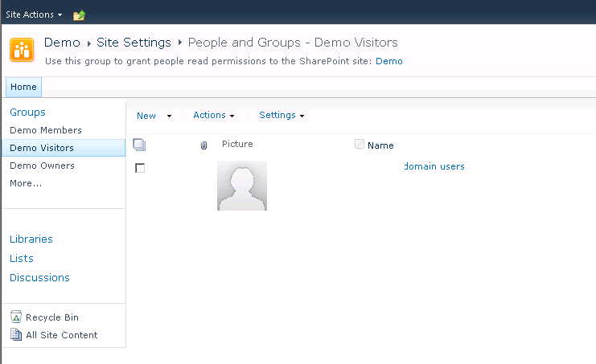
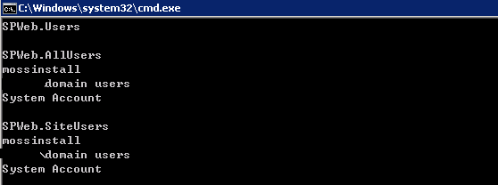
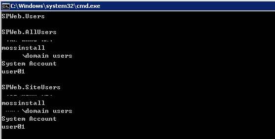
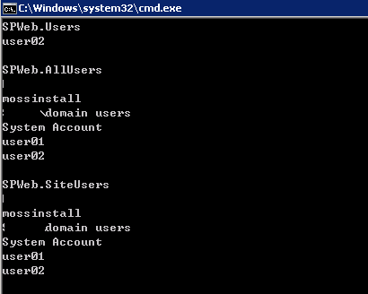
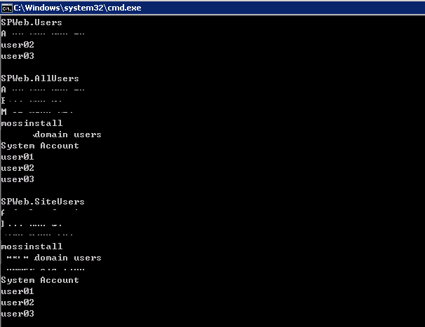

# SharePoint Users AllUsers SiteUsers
	作者：jingnansu

注意: 本文讨论基于SharePoint 2010. 本文比较罗嗦, 大神直接可以PASS.

## 前奏
大家都知道SPWeb有三个属性可以获取相关用户集合:
<table>
    <tr>
        <td>SPWeb.Users</td>
        <td>Gets the collection of user objects that are explicitly assigned permissions in the website.</td>
    </tr>
    <tr>
        <td>SPWeb.AllUsers</td>
        <td>Gets the collection of user objects that represents all users who are either members of the site or who have browsed to the site as authenticated members of a domain group in the site.</td>
    </tr>
    <tr>
        <td>SPWeb.SiteUsers</td>
        <td>Gets the collection of all users that belong to the site collection.</td>
    </tr>
</table>

下面我们依次做几个实验来看看这三个属性中分别包含了哪些用户组或者用户在里面.

## 第一回
当我们新建一个网站集的时候, 会将Domain中的Users组直接赋予只读的权限. 这时候我们来看看这三个属性中的值是怎么样的:

## 第二回
这时候当多个用户去访问该站点的时候, 又会怎么样呢?

## 第三回
当某个用户需要自定义权限或者新建一个SharePoint用户组并且赋予某用户权限, 又会怎么样呢? 

## SPWeb.EnsureUser
当通过EnsureUser将某个用户加到网站集的时候, 情况如下图:

这时候发现SiteUsers中相比AllUsers多了一个用户.

## 结束语
这时候大家应该都清楚从用户数来说: SiteUsers>AllUsers>Users, 还有他们三者之间的差别了嘛?

enjoy SharePoint